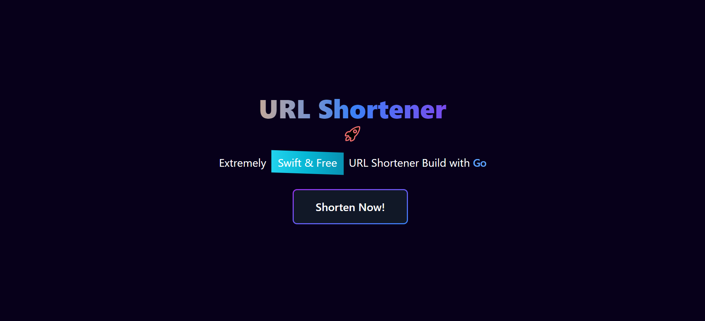
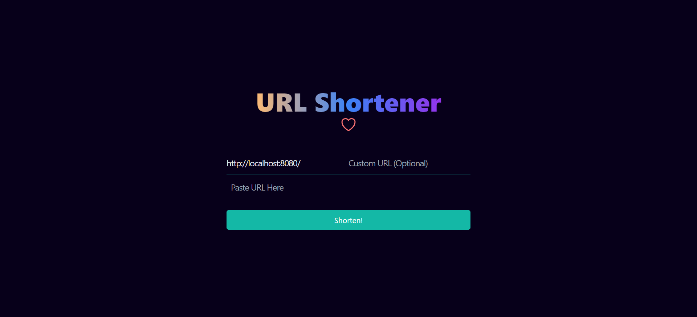
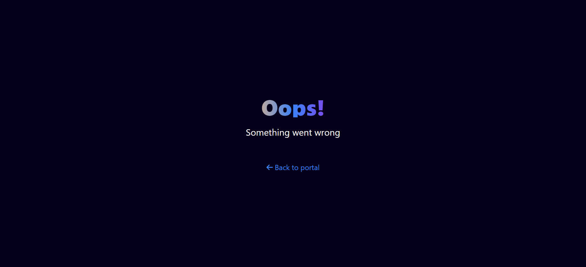

## Fiber Shortener

### Description

This repository contains a URL shortener built with the Golang web framework Fiber, Redis for caching, and the Tailwind CSS framework for styling. The application allows users to input a long URL and receive a shortened version that can be easily shared and tracked. Additionally, users have the option to customize their shortened URL by specifying a unique slug. The usage of Redis as a cache improves the performance of the application by reducing the number of database queries.

### Disclaimer

This project is far from perfect and there is always room for improvement. If you would like to contribute, please feel free to fork this repository and submit a pull request. Your contributions are welcome and appreciated.

### UI

- index
  
- shortener
  
- error
  
